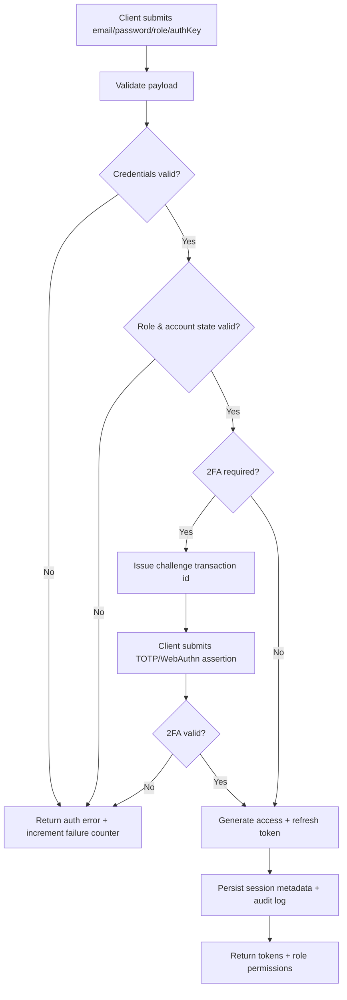
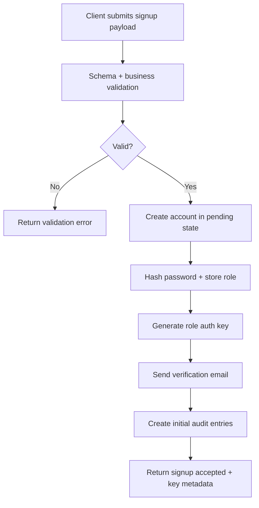
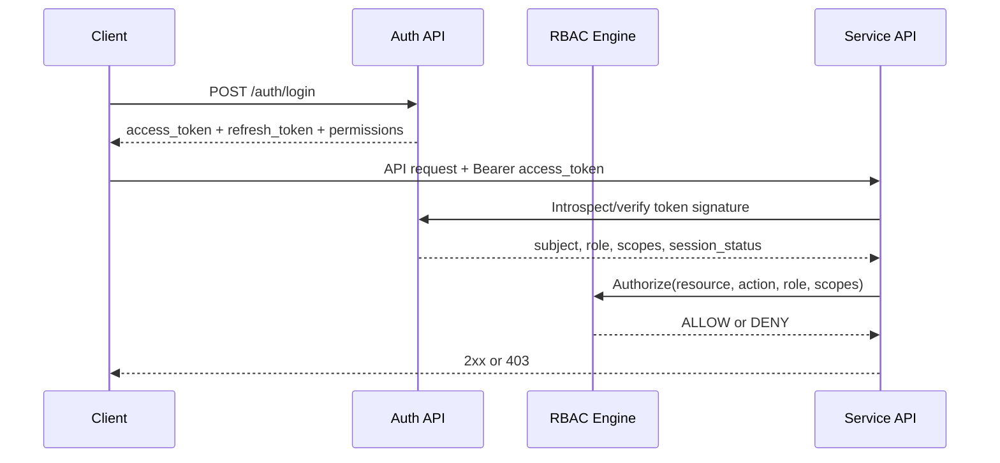

# Authentication Specification (Backend Implementation)

## 1) Scope and Roles

This specification defines authentication and post-auth authorization for three operational roles:

- **Enterprise**
- **Verifier**
- **Admin**

It covers login, signup, token/session behavior, security controls, API contracts, failure modes, and test criteria.

## 2) Authentication Method Matrix

| Method | Enterprise | Verifier | Admin | Notes |
|---|---|---|---|---|
| Email + Password | Required | Required | Required | Primary credential for all roles |
| Role Auth Key (portal key) | Required | Required | Required | Secondary possession factor during login |
| OAuth 2.0 (Google/GitHub) | Optional | Optional | Disallowed in production | Allowed for non-admin convenience; admin uses managed credentials only |
| SSO (SAML/OIDC Enterprise IdP) | Optional | Optional | Optional | Recommended for enterprise organizations and internal admin workforce |
| TOTP 2FA | Required after first login | Required after first login | Required always | RFC 6238 TOTP |
| Recovery codes | Supported | Supported | Supported | One-time backup codes for 2FA recovery |
| WebAuthn passkey | Optional | Optional | Optional (recommended) | Step-up and phishing resistance |
| API key bootstrap | Optional | Optional | Optional | API key issuance still requires authenticated user + permission checks |

## 3) Login Requirements by Role

### 3.1 Shared Mandatory Fields

- `email` (RFC 5322-valid email format)
- `password` (plaintext over TLS only; backend hashes server-side)
- `role` (enum: `enterprise | verifier | admin`)
- `authKey` (role-specific secret key string)

### 3.2 Field Validation Rules

- `email`
  - Trim and lowercase before lookup.
  - Max length: 254.
- `password`
  - Length: 12 to 128.
  - Must satisfy password policy in section 6.
- `role`
  - Must match account-assigned role exactly; role escalation in request is rejected.
- `authKey`
  - Min length: 24.
  - Max length: 256.
  - Compare using constant-time comparison with hashed stored key.

### 3.3 Role-Specific Login Constraints

#### Enterprise
- Account status must be `active`.
- Business domain must be verified if organization policy requires domain lock.
- 2FA required after first successful password login.

#### Verifier
- Account status must be `active`.
- `kyc_status` for verifier operator must be `approved`.
- Optional device integrity checks may be enforced for high-risk actions.

#### Admin
- Account status must be `active`.
- Must pass 2FA every login, no remember-device bypass in production.
- Login must pass IP allowlist and risk policy.

### 3.4 Session Management

- Access token: JWT, TTL = **15 minutes**.
- Refresh token: opaque, rotating, TTL = **30 days**, stored server-side hash.
- Refresh token rotation:
  - Every refresh invalidates previous token.
  - Reuse detection revokes full session family.
- Concurrent session limits:
  - Enterprise: 5 active sessions/user.
  - Verifier: 3 active sessions/user.
  - Admin: 2 active sessions/user.
- Idle timeout:
  - Enterprise/Verifier: 30 minutes.
  - Admin: 15 minutes.
- Absolute session timeout:
  - Enterprise/Verifier: 12 hours.
  - Admin: 8 hours.

## 4) Signup Requirements by Role

### 4.1 Enterprise Signup Payload

| Field | Type | Required | Constraints |
|---|---|---|---|
| `organizationName` | string | Yes | 2..120 chars |
| `contactName` | string | Yes | 2..80 chars |
| `email` | string | Yes | business email format, unique |
| `password` | string | Yes | policy-compliant |
| `role` | enum | Yes | must be `enterprise` |
| `countryCode` | string | Yes | ISO-3166 alpha-2 |
| `registrationNumber` | string | Yes | 3..64 chars |
| `consentAccepted` | boolean | Yes | must be `true` |

### 4.2 Verifier Signup Payload

| Field | Type | Required | Constraints |
|---|---|---|---|
| `organizationName` | string | Yes | 2..120 chars |
| `contactName` | string | Yes | 2..80 chars |
| `email` | string | Yes | unique |
| `password` | string | Yes | policy-compliant |
| `role` | enum | Yes | must be `verifier` |
| `verificationLicenseId` | string | Yes | 3..100 chars |
| `jurisdiction` | string | Yes | 2..80 chars |
| `consentAccepted` | boolean | Yes | must be `true` |

### 4.3 Admin Signup Payload

| Field | Type | Required | Constraints |
|---|---|---|---|
| `fullName` | string | Yes | 2..80 chars |
| `email` | string | Yes | company domain only, unique |
| `password` | string | Yes | policy-compliant, admin strength checks |
| `role` | enum | Yes | must be `admin` |
| `department` | string | Yes | 2..80 chars |
| `authorizationCode` | string | Yes | server-issued onboarding code |
| `consentAccepted` | boolean | Yes | must be `true` |

### 4.4 Signup Processing Requirements

- Validate all fields before any write.
- Enforce uniqueness for `email`.
- Hash password with Argon2id.
- Generate role auth key at signup completion and return once.
- Require email verification before first privileged access.
- Emit audit event for account creation and key generation.

## 5) Authentication Flows

### 5.1 Login Flow



### 5.2 Signup Flow



### 5.3 Token and RBAC Enforcement Flow



## 6) Security Requirements

### 6.1 Password Policy

- Minimum length: 12.
- At least 1 uppercase, 1 lowercase, 1 digit, 1 symbol.
- Reject known breached passwords.
- Reject sequences and role/email-derived weak patterns.
- Password history:
  - Enterprise/Verifier: cannot reuse last 5.
  - Admin: cannot reuse last 10.

### 6.2 Account Lockout and Abuse Controls

- Progressive lockout:
  - 5 failed logins: lock 15 minutes.
  - 10 failed logins in 24h: lock 24 hours + alert.
- IP and user-agent rate limits:
  - Login endpoint: 10 attempts per 5 minutes per IP.
  - Signup endpoint: 5 attempts per hour per IP.
- Risk-based controls:
  - New device/location: force 2FA challenge.
  - Admin high-risk login: require step-up authentication.

### 6.3 Audit Logging

Mandatory events:
- `auth.login.success`
- `auth.login.failure`
- `auth.logout`
- `auth.signup.requested`
- `auth.signup.completed`
- `auth.password.reset.requested`
- `auth.password.reset.completed`
- `auth.2fa.enabled`
- `auth.2fa.challenge.failed`
- `auth.session.revoked`

Each event must include:
- `eventId`, `timestamp`, `userId` (if known), `role`, `ip`, `userAgent`, `requestId`, `outcome`, `reasonCode`.

## 7) Authentication API Specifications

Base path: `/auth`

### 7.1 POST `/auth/login`

Request:
```json
{
  "email": "admin@company.com",
  "password": "StrongPassword!234",
  "role": "admin",
  "authKey": "vz_xxxxx",
  "mfa": {
    "method": "totp",
    "code": "123456"
  }
}
```

Success `200`:
```json
{
  "success": true,
  "data": {
    "accessToken": "jwt",
    "refreshToken": "opaque",
    "tokenType": "Bearer",
    "expiresIn": 900,
    "user": {
      "id": "usr_123",
      "email": "admin@company.com",
      "role": "admin"
    },
    "permissions": ["admin:read", "admin:write"]
  }
}
```

MFA challenge `202`:
```json
{
  "success": true,
  "data": {
    "mfaRequired": true,
    "challengeId": "mfa_ch_123",
    "methods": ["totp", "webauthn"]
  }
}
```

### 7.2 POST `/auth/signup`

Request:
```json
{
  "role": "enterprise",
  "organizationName": "Acme Corp",
  "contactName": "Jane Doe",
  "email": "security@acme.com",
  "password": "StrongPassword!234",
  "countryCode": "US",
  "registrationNumber": "REG-12345",
  "consentAccepted": true
}
```

Success `201`:
```json
{
  "success": true,
  "data": {
    "userId": "usr_123",
    "role": "enterprise",
    "status": "pending_email_verification",
    "generatedAuthKey": "vz_generated_once"
  }
}
```

### 7.3 POST `/auth/mfa/verify`

Request:
```json
{
  "challengeId": "mfa_ch_123",
  "method": "totp",
  "code": "123456"
}
```

Success `200`: returns same token payload as login success.

### 7.4 POST `/auth/refresh`

Request:
```json
{
  "refreshToken": "opaque"
}
```

Success `200`: new access token and rotated refresh token.

### 7.5 POST `/auth/logout`

Request:
```json
{
  "refreshToken": "opaque",
  "allSessions": false
}
```

Success `204` (no body).

### 7.6 POST `/auth/forgot-password`

Request:
```json
{
  "email": "user@company.com"
}
```

Success `202` to avoid account enumeration.

### 7.7 POST `/auth/reset-password`

Request:
```json
{
  "token": "pwd_reset_token",
  "newPassword": "NewStrongPassword!123"
}
```

Success `200`: password changed, sessions revoked.

### 7.8 GET `/auth/me`

Requires bearer access token.

Success `200`:
```json
{
  "success": true,
  "data": {
    "id": "usr_123",
    "email": "user@company.com",
    "role": "enterprise",
    "permissions": ["kyc:write", "kyc:read"]
  }
}
```

## 8) Error Handling and Status Codes

| Status | Code | Meaning |
|---|---|---|
| 400 | `validation_error` | Request fields invalid |
| 401 | `invalid_credentials` | Email/password/auth key mismatch |
| 401 | `token_invalid` | Access token invalid/expired |
| 401 | `mfa_failed` | Invalid or expired MFA challenge/code |
| 403 | `role_mismatch` | Requested role does not match account role |
| 403 | `account_disabled` | Account suspended/disabled |
| 403 | `ip_blocked` | Source IP disallowed by policy |
| 409 | `email_conflict` | Email already registered |
| 423 | `account_locked` | Lockout due to failed attempts |
| 429 | `rate_limited` | Too many auth attempts |
| 500 | `auth_internal_error` | Internal authentication error |

Standard error response:
```json
{
  "success": false,
  "error": {
    "code": "invalid_credentials",
    "message": "Invalid email, password, or auth key",
    "details": []
  },
  "requestId": "req_123"
}
```

## 9) Testing Criteria

### 9.1 Login Tests

- Valid login per role returns tokens and correct role.
- Invalid password, invalid auth key, invalid role each fails with correct status/code.
- MFA required role path returns `202`, then successful challenge returns `200`.
- Locked account returns `423`.
- Rate limit exceeded returns `429`.

### 9.2 Signup Tests

- Valid enterprise/verifier/admin payloads create correct role accounts.
- Missing mandatory fields fail with `400`.
- Invalid format fields fail with `400`.
- Duplicate email fails with `409`.
- Generated auth key returned once and never retrievable in plaintext again.

### 9.3 Token and Session Tests

- Expired access token rejected with `401`.
- Refresh token rotation invalidates prior refresh token.
- Refresh token reuse triggers family revocation.
- Logout revokes current or all sessions as requested.

### 9.4 Security Tests

- Password policy enforced for all roles.
- Lockout activates at configured thresholds.
- Admin login requires MFA every time.
- Audit events emitted for all auth outcomes.

### 9.5 RBAC Tests

- Enterprise user denied admin endpoints.
- Verifier user denied enterprise-admin endpoints.
- Admin can access admin routes and management actions.
- Token `role` + `permissions` claims are enforced in every protected endpoint.

## 10) Role-Specific Permissions and Access Levels

### Enterprise

- Access level: partner operations.
- Typical permissions: `kyc:write`, `kyc:read`, `documents:write`, `biometrics:write`, `screening:write`, `aml:write`, `webhooks:read`, `webhooks:write`, `analytics:read`, `reports:write`, `audit:read`.
- UI route scope: `/enterprise/*`.

### Verifier

- Access level: verification execution and review.
- Typical permissions: `verification:read`, `verification:review`, `verification:write`, `verifier:profile:read`, `verifier:profile:write`.
- UI route scope: `/verifier/*`.

### Admin

- Access level: platform governance and security administration.
- Typical permissions: `admin:read`, `admin:write`, `users:manage`, `verifiers:manage`, `enterprises:manage`, `audit:read`, `system:manage`, `reports:write`.
- UI route scope: `/admin/*`.

## 11) Implementation Notes

- All authentication endpoints require TLS 1.2+.
- Secrets are never logged in plaintext.
- Password and auth key storage must be hashed and salted.
- JWT signing keys must rotate periodically and support key IDs (`kid`).
- Every auth response should include a `requestId` for traceability.

