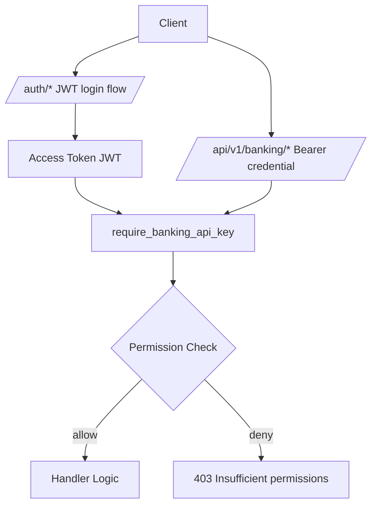

# Admin & Verifier API Surface Audit

## Scope And Method
- **Code scanned:** `app.py`, `banking/auth_api.py`, `banking/auth.py`, `banking/api.py`, and all `banking/routers/*` modules that expose role-relevant routes.
- **Docs scanned:** `AUTH_API_FRONTEND_GUIDE.md` and selected API reference docs under `website/docs/api-reference/banking/`.
- **Definition of in-scope endpoint:** any route that is reachable by users authenticated as `admin` or `verifier`, or routes explicitly bound to admin/verifier workflows.
- **Source of truth:** backend implementation. Documentation discrepancies are explicitly noted.

## Architecture Snapshot


## RBAC Baseline

### Role Permissions (Implemented)
```json
{
  "verifier": [
    "verification:read",
    "verification:review",
    "verification:write",
    "verifier:profile:read",
    "verifier:profile:write"
  ],
  "admin": [
    "admin:read",
    "admin:write",
    "users:manage",
    "verifiers:manage",
    "enterprises:manage",
    "zk:read",
    "zk:write",
    "blockchain:read",
    "blockchain:write",
    "api_keys:read",
    "api_keys:write",
    "webhooks:read",
    "webhooks:write",
    "license:read",
    "license:write",
    "api_settings:read",
    "api_settings:write",
    "team:invite",
    "settings:read",
    "settings:write",
    "audit:read",
    "system:manage",
    "reports:write",
    "diagnostics:read",
    "diagnostics:retry",
    "diagnostics:cancel"
  ]
}
```

### Important RBAC Mechanics
- `require_banking_api_key` accepts either:
  - API keys from `api_keys` table, or
  - auth JWT access tokens (mapped into an `ApiKeyContext`).
- `require_permission` enforces exact string match or wildcard `*`.
- Endpoints are permission-gated, not hard role-gated (except auth signup/login role validations).

## Endpoint Inventory

### A) Auth Endpoints (Admin/Verifier Lifecycle)

All routes below support both `admin` and `verifier` identities, with role-specific validation and outcomes.

| Method | Path | Access Model | Request Body Model | Success | Common Errors |
|---|---|---|---|---|---|
| POST | `/auth/signup` | Public (role in body) | `SignupRequest` | `201` | `400 validation_error`, `409 email_conflict`, `429 rate_limited` |
| POST | `/auth/login` | Public credentials | `LoginRequest` | `200` or `202` (MFA challenge) | `400`, `401 invalid_credentials`, `401 mfa_failed`, `403 role_mismatch/account_disabled/ip_blocked`, `423`, `429` |
| POST | `/auth/mfa/verify` | MFA challenge | `MFAVerifyRequest` | `200` | `401 mfa_failed` |
| GET | `/auth/mfa/enroll` | Bearer access token | N/A | `200` | `401 token_invalid` |
| POST | `/auth/mfa/enroll/verify` | Bearer access token | `MFAEnrollVerifyRequest` | `200` | `400 validation_error`, `401 mfa_failed` |
| POST | `/auth/mfa/recovery-code/verify` | MFA challenge | `MFARecoveryCodeVerifyRequest` | `200` | `401 mfa_failed` |
| POST | `/auth/refresh` | Refresh token | `RefreshRequest` | `200` | `401 token_invalid` |
| POST | `/auth/logout` | Refresh token | `LogoutRequest` | `204` | None (idempotent behavior) |
| POST | `/auth/forgot-password` | Public | `ForgotPasswordRequest` | `202` | None (account enumeration resistant) |
| POST | `/auth/reset-password` | Reset token | `ResetPasswordRequest` | `200` | `400 validation_error`, `401 token_invalid` |
| GET | `/auth/me` | Bearer access token | N/A | `200` | `401 token_invalid` |

#### Segmented Auth Aliases
- Same contracts are mirrored at `/{role}/auth/*` for:
  - `login`, `signup`, `mfa/verify`, `mfa/recovery-code/verify`, `mfa/enroll`, `mfa/enroll/verify`, `refresh`, `logout`, `forgot-password`, `reset-password`, `me`.
- Path role must be one of: `user`, `verifier`, `enterprise`, `manager`, `admin`.

### B) Shared Admin+Verifier Data Endpoints

| Method | Path | Permission Gate | Access |
|---|---|---|---|
| GET | `/api/v1/banking/user/verifications` | any of `kyc:read`, `verification:read`, `admin:read` | Admin + Verifier |
| GET | `/api/v1/banking/notifications` | any of `kyc:read`, `verification:read`, `admin:read` | Admin + Verifier |
| GET | `/api/v1/banking/marketplace/verifiers` | any of `kyc:read`, `verification:read`, `admin:read` | Admin + Verifier |
| GET | `/api/v1/banking/user/wallet` | any of `kyc:read`, `verification:read`, `admin:read` | Admin + Verifier |

### C) Admin-Only (By Default Role Permission Set)

| Method | Path | Permission Gate |
|---|---|---|
| GET | `/api/v1/banking/admin/system-health` | `admin:read` |
| GET | `/api/v1/banking/admin/alerts` | `admin:read` |
| GET | `/api/v1/banking/admin/users` | `admin:read` |
| GET | `/api/v1/banking/admin/verifiers` | `admin:read` |
| GET | `/api/v1/banking/admin/verifiers/{id}` | `admin:read` |
| POST | `/api/v1/banking/team/invitations` | `team:invite` |
| POST | `/api/v1/banking/team/invitations/{invitationId}/resend` | `team:invite` |
| GET | `/api/v1/banking/license/usage` | `license:read` |
| POST | `/api/v1/banking/license/plan/change` | `license:write` |
| GET | `/api/v1/banking/api/settings` | `api_settings:read` |
| PATCH | `/api/v1/banking/api/settings` | `api_settings:write` |
| POST | `/api/v1/banking/billing/checkout/session` | `license:write` |
| GET | `/api/v1/banking/settings/company` | `settings:read` |
| PATCH | `/api/v1/banking/settings/company` | `settings:write` |
| POST | `/api/v1/banking/settings/company/logo` | `settings:write` |
| POST | `/api/v1/banking/api-keys/create` | `api_keys:write` (bootstrap fallback via `x-ontiver-admin-token`) |
| GET | `/api/v1/banking/api-keys/validate/current` | authenticated bearer credential |
| GET | `/api/v1/banking/api-keys` | `api_keys:read` |
| DELETE | `/api/v1/banking/api-keys/{keyId}` | `api_keys:write` |
| POST | `/api/v1/banking/webhooks/register` | `webhooks:write` |
| GET | `/api/v1/banking/webhooks` | `webhooks:read` |
| DELETE | `/api/v1/banking/webhooks/{webhookId}` | `webhooks:write` |
| POST | `/api/v1/banking/webhooks/test` | `webhooks:write` |
| POST | `/api/v1/banking/webhooks/{webhookId}/test` | `webhooks:write` |
| POST | `/api/v1/banking/webhooks/{webhookId}/rotate-secret` | `webhooks:write` |
| GET | `/api/v1/banking/webhooks/retries` | `webhooks:read` |
| POST | `/api/v1/banking/zk-proof/generate` | `zk:write` |
| POST | `/api/v1/banking/zk-proof/verify` | `zk:read` |
| GET | `/api/v1/banking/zk-proof/verification/{verificationId}` | `zk:read` |
| POST | `/api/v1/banking/zk-proof/disclose` | `zk:read` |
| GET | `/api/v1/banking/zk-proof/circuits` | `zk:read` |
| GET | `/api/v1/banking/zk-proof/noir/toolchain` | `zk:read` |
| POST | `/api/v1/banking/zk-proof/noir/generate` | `zk:write` |
| POST | `/api/v1/banking/zk-proof/noir/verify` | `zk:read` |
| POST | `/api/v1/banking/blockchain/anchor` | `blockchain:write` |
| POST | `/api/v1/banking/blockchain/proof` | `blockchain:read` |
| GET | `/api/v1/banking/blockchain/proof/{verificationId}` | `blockchain:read` |
| GET | `/api/v1/banking/diagnostics/requests` | `diagnostics:read` |
| POST | `/api/v1/banking/diagnostics/requests/{requestId}/retry` | `diagnostics:retry` |
| POST | `/api/v1/banking/diagnostics/requests/{requestId}/cancel` | `diagnostics:cancel` |
| GET | `/api/v1/banking/audit/customer/{customerId}` | `audit:read` |
| GET | `/api/v1/banking/audit/verification/{verificationId}` | `audit:read` |
| POST | `/api/v1/banking/reports/create` | `reports:write` |

### D) Verifier-Specific Endpoints

| Method | Path | Permission Gate | Notes |
|---|---|---|---|
| GET | `/api/v1/banking/verifier/profile` | `verification:read` | Reachable by verifier and any role/API key carrying this permission |
| PATCH | `/api/v1/banking/verifier/profile` | `verification:write` | Updates profile-like fields |

## Request Schema Catalog

### Auth DTOs
```json
{
  "SignupRequest": {
    "role": "string (required, one of user/verifier/enterprise/manager/admin)",
    "email": "string (required, normalized, max 254 validated by regex)",
    "password": "string (required, 12-128, uppercase/lowercase/digit/symbol)",
    "consentAccepted": "boolean (required)",
    "organizationName": "string (required for verifier/enterprise)",
    "contactName": "string (required for verifier/enterprise)",
    "countryCode": "string (required for enterprise)",
    "registrationNumber": "string (required for enterprise)",
    "verificationLicenseId": "string (required for verifier)",
    "jurisdiction": "string (required for verifier)",
    "fullName": "string (required for admin/manager)",
    "department": "string (required for admin/manager)",
    "authorizationCode": "string (required for admin/manager; must match AUTH_ADMIN_ONBOARDING_CODE)"
  },
  "LoginRequest": {
    "email": "string",
    "password": "string",
    "role": "string",
    "authKey": "string (24-256)",
    "mfa": { "method": "string", "code": "string" }
  },
  "MFAVerifyRequest": { "challengeId": "string", "method": "string", "code": "string" },
  "MFAEnrollVerifyRequest": { "method": "string=totp", "code": "string (alias: totpCode/otp/mfaCode/token)" },
  "MFARecoveryCodeVerifyRequest": { "challengeId": "string", "code": "string" },
  "RefreshRequest": { "refreshToken": "string" },
  "LogoutRequest": { "refreshToken": "string", "allSessions": "boolean(default false)" },
  "ForgotPasswordRequest": { "email": "string" },
  "ResetPasswordRequest": { "token": "string", "newPassword": "string" }
}
```

### Admin/Verifier Banking DTOs
```json
{
  "TeamInviteBody": {
    "email": "string (required, regex email)",
    "role": "string (required, one of Admin/Manager/Analyst/Viewer)",
    "message": "string (optional, maxLength 1000)"
  },
  "InvitationAcceptBody": { "token": "string (minLength 32)" },
  "ApiSettingsPatchBody": {
    "autoRotateSecrets": "boolean",
    "ipWhitelistEnabled": "boolean",
    "allowedIps": "string[] (required non-empty valid CIDR/IP when ipWhitelistEnabled=true)"
  },
  "CompanySettingsPatchBody": {
    "companyName": "string (1..160)",
    "email": "string (required, regex email)",
    "website": "HttpUrl optional",
    "industry/taxId/phone/address": "optional strings",
    "notifications": "optional object<string, boolean>",
    "security": "optional object"
  },
  "CheckoutSessionBody": {
    "targetPlan": "string",
    "billingInterval": "string (monthly|yearly)"
  },
  "ApiKeyCreateBody": {
    "keyName|name": "string (1..128)",
    "permissions|scopes": "string[]",
    "environment": "production|sandbox",
    "expiresAt": "ISO datetime optional",
    "ipWhitelist": "string[] optional",
    "rateLimit": "integer >=0 optional"
  },
  "WebhookRegisterBody": {
    "webhookUrl|url": "HttpUrl optional",
    "events": "string[]",
    "secret": "string optional (8..256)",
    "active": "boolean default true"
  },
  "WebhookTestBody": {
    "webhookId": "string optional",
    "webhookUrl": "HttpUrl optional",
    "eventType": "string",
    "payload": "object optional"
  },
  "ZkGenerateBody": {
    "proofType": "string (1..64)",
    "verificationId": "string optional",
    "statement": "object required",
    "witness/publicSignals/disclosureFields": "optional"
  },
  "ZkNoirGenerateBody": {
    "circuitId": "string (1..64)",
    "privateInputs": "object required",
    "publicInputs": "object required",
    "verifierTarget": "evm|noir-recursive",
    "verificationId/submittedData/publicSignals/disclosureFields": "optional"
  },
  "ZkNoirVerifyBody": {
    "proofId": "optional",
    "circuitId/proofData/publicInputsData/verificationKeyData": "required if proofId omitted"
  },
  "BlockchainAnchorBody": {
    "verificationId": "string",
    "chain": "string default ethereum",
    "anchorData": "object"
  },
  "BlockchainProofBody": { "anchorId": "string" },
  "RetryRequestBody": {
    "retryInMs": "integer (0..86400000)",
    "message": "string optional"
  },
  "CancelRequestBody": { "message": "string optional" },
  "AuditExportBody": {
    "startDate/endDate": "string optional",
    "format": "json|csv"
  },
  "ReportCreateBody": {
    "reportType": "verification_summary|compliance_summary|risk_distribution (optional)",
    "type": "compliance|audit|activity (optional fallback)",
    "dateRange": "object required",
    "filters": "object optional",
    "format": "pdf|csv|excel",
    "includeCharts": "boolean default false"
  },
  "VerifierProfilePatchBody": {
    "title/description/website/location": "optional strings",
    "languages/specializations": "optional string[]"
  }
}
```

## Response Schema Patterns

### Standard Banking Envelope
```json
{
  "success": true,
  "data": {},
  "timestamp": "ISO-8601"
}
```

### Auth Envelope
```json
{
  "success": true,
  "data": {},
  "requestId": "string"
}
```

### Token Success Payload (Auth)
```json
{
  "accessToken": "jwt",
  "refreshToken": "rt_...",
  "tokenType": "Bearer",
  "expiresIn": 900,
  "user": { "id": "usr_x", "email": "user@example.com", "role": "admin|verifier|..." },
  "permissions": ["permission:string"]
}
```

### Common Error Payloads
```json
{
  "success": false,
  "error": {
    "code": "validation_error|token_invalid|mfa_failed|...",
    "message": "human readable",
    "details": []
  },
  "requestId": "string"
}
```

## Endpoint-Level Examples

### Admin System Health
`GET /api/v1/banking/admin/system-health`
```json
{
  "success": true,
  "data": {
    "overallStatus": "operational|degraded|down",
    "generatedAt": "2026-04-05T12:00:00Z",
    "environment": "prod|staging|dev",
    "readiness": {},
    "services": [
      { "name": "Database", "status": "operational", "uptime": "99.95%", "latencyMs": 2.1 }
    ]
  },
  "timestamp": "2026-04-05T12:00:00Z"
}
```

### Verifier Profile Update
`PATCH /api/v1/banking/verifier/profile`
```json
{
  "title": "Senior Verifier",
  "description": "KYC specialist",
  "website": "https://example.com",
  "languages": ["en", "fr"],
  "specializations": ["kyc", "sanctions"]
}
```

### API Key Create (Admin Reachable)
`POST /api/v1/banking/api-keys/create`
```json
{
  "keyName": "Dashboard Key",
  "permissions": ["api_keys:read", "webhooks:write"],
  "environment": "production",
  "rateLimit": 1000
}
```

### ZK Noir Generate
`POST /api/v1/banking/zk-proof/noir/generate`
```json
{
  "circuitId": "age_over_threshold",
  "verificationId": "ver_123",
  "privateInputs": { "age": 26 },
  "publicInputs": { "threshold": 18 },
  "verifierTarget": "evm"
}
```

## Access-Control Verification Results

### Confirmed
- Admin has working permission paths into:
  - admin dashboards, diagnostics, API key management, webhook management, blockchain, ZK, reports create, settings/license/team operations, and audit read APIs.
- Verifier has working permission paths into:
  - verifier profile read/write and shared visibility endpoints (`user/verifications`, `notifications`, `marketplace/verifiers`, `user/wallet`) via `verification:read`.

### Not Reachable By Default Role Maps
- `/api/v1/banking/verifier/issue-credential` requires `did:write`, but default `verifier` and `admin` role permission sets do not include `did:write`.
- `/api/v1/banking/reports/{reportId}` and `/api/v1/banking/reports` require `reports:read`, but `admin` has only `reports:write`.
- `/api/v1/banking/audit/export` requires `audit:write`, but `admin` has only `audit:read`.

## Security Assessment

### High-Risk Findings
1. **Verification API may run without auth if `API_KEY` env var is unset.**
   - `verification/api.py` `require_api_key()` returns without validation when `API_KEY` is missing.
   - Effect: public access to `/verification/verify`, `/verify-webcam`, `/verify-document`, `/verify-mobile-liveness`.

2. **Model control endpoint is unauthenticated.**
   - `POST /verification/model/reload` has no API key or role check.
   - Effect: unauthorized model reload attempts / potential service disruption.

### Medium-Risk Findings
1. **Secret defaults are insecure for production if not overridden.**
   - Defaults include `AUTH_JWT_SECRET`, invitation token secret, and billing webhook secret dev values.

2. **Permission-based gating can bypass role intent if API keys are over-permissioned.**
   - Endpoints enforce permissions, not explicit role claims.
   - If API key is granted powerful scopes, non-admin principal can invoke admin-style operations.

3. **Sensitive secret return paths.**
   - Webhook secret rotation returns `newSecret` in response body.
   - API key create returns raw `apiKey` (expected one-time behavior but sensitive).

### Low-Risk / Consistency Findings
1. **Segmented auth role path is syntactic, not semantic.**
   - `/{role}/auth/me` validates only that path role is a known enum, then delegates to regular `me` without matching token role.

2. **Implementation-doc path drift.**
   - Docs frequently use `/zk/*`, while code exposes `/zk-proof/*`.
   - Some docs describe response fields not implemented in current handlers.

## Documentation Drift Notes (Code vs Docs)
- Docs state broad "all endpoints require Bearer API key"; implementation also accepts auth JWT access tokens in `require_banking_api_key`.
- Docs include endpoint families and rich fields that are stubs or simplified in code for some routes.
- Verify-documentation readers should rely on generated OpenAPI/runtime behavior, not only markdown docs.

## Data Model / Persistence Mapping (Role-Relevant)

### Auth Core Tables
- `auth_users`
  - identity, role, password hash, role key hash, status, MFA secrets, admin IP allowlist.
- `auth_sessions`
  - role-bound session metadata, idle and absolute expiry, revoke state.
- `auth_refresh_tokens`
  - refresh rotation and replay detection.
- `auth_mfa_challenges`
  - challenge lifecycle state.

### Admin Feature Tables
- `api_keys`, `api_settings`, `team_invitations`, `team_members`
- `license_subscriptions`, `billing_checkout_sessions`, `billing_webhook_events`
- `webhook_endpoints`
- `request_diagnostics_events`, `request_diagnostics_retry_queue`
- `blockchain_anchors`
- `report_jobs`
- `audit_events`

## Recommended Hardening Actions
1. Enforce mandatory auth on all `/verification/*` operational endpoints regardless of env.
2. Protect `/verification/model/reload` with admin permission + signed internal auth.
3. Add role-claim enforcement where role-specific URL segments exist (`/{role}/auth/*`).
4. Introduce explicit permission matrix tests ensuring intended role reachability for each endpoint.
5. Add docs generation from code contracts to reduce path/schema drift.
