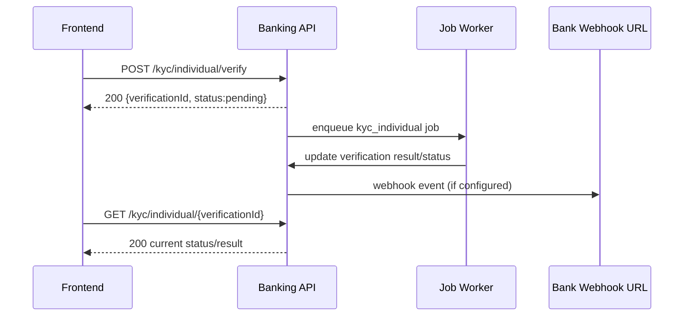
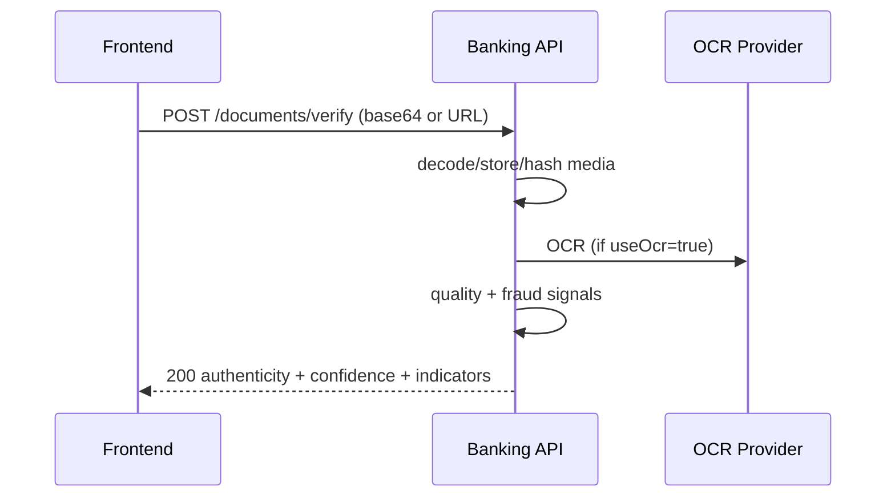

# Phase 1 Frontend Integration Specification (Backend-Verified)

## 1) Scope and Method

This specification is generated from the **actual implemented backend code** and aligned to the Phase 1 API requirements in `phase1.md`.

- Backend base prefix: `/api/v1/banking`
- Phase 1 required APIs: 21
- Phase 1 implemented APIs found in code: **21/21**
- Success envelope used by banking APIs:  
  `{"success": true, "data": <payload>, "timestamp": "<iso8601>"}`

## 2) Implementation Coverage (Phase 1 Requirement → Actual Backend)

| # | Feature | Method | Full URL Path | Implemented | Permission |
|---|---|---|---|---|---|
| 1 | Individual KYC Verify | POST | `/api/v1/banking/kyc/individual/verify` | Yes | `kyc:write` |
| 2 | Individual KYC Status | GET | `/api/v1/banking/kyc/individual/{verificationId}` | Yes | `kyc:read` |
| 3 | Individual KYC Basic | POST | `/api/v1/banking/kyc/individual/basic` | Yes | `kyc:write` |
| 4 | Document Verify | POST | `/api/v1/banking/documents/verify` | Yes | `documents:write` |
| 5 | Document Extract OCR | POST | `/api/v1/banking/documents/extract` | Yes | `documents:write` |
| 6 | Face Match | POST | `/api/v1/banking/biometrics/face-match` | Yes | `biometrics:write` |
| 7 | Liveness | POST | `/api/v1/banking/biometrics/liveness` | Yes | `biometrics:write` |
| 8 | Sanctions Screening | POST | `/api/v1/banking/screening/sanctions/check` | Yes | `screening:write` |
| 9 | PEP Screening | POST | `/api/v1/banking/screening/pep/check` | Yes | `screening:write` |
| 10 | AML Risk Score | POST | `/api/v1/banking/aml/risk-score` | Yes | `aml:write` |
| 11 | AML Transaction Monitoring | POST | `/api/v1/banking/aml/transaction-monitoring` | Yes | `aml:write` |
| 12 | Register Webhook | POST | `/api/v1/banking/webhooks/register` | Yes | `webhooks:write` |
| 13 | List Webhooks | GET | `/api/v1/banking/webhooks` | Yes | `webhooks:read` |
| 14 | Delete Webhook | DELETE | `/api/v1/banking/webhooks/{webhookId}` | Yes | `webhooks:write` |
| 15 | Create API Key | POST | `/api/v1/banking/api-keys/create` | Yes | `api_keys:write`* |
| 16 | List API Keys | GET | `/api/v1/banking/api-keys` | Yes | `api_keys:read` |
| 17 | Revoke API Key | DELETE | `/api/v1/banking/api-keys/{keyId}` | Yes | `api_keys:write` |
| 18 | Audit by Customer | GET | `/api/v1/banking/audit/customer/{customerId}` | Yes | `audit:read` |
| 19 | Audit by Verification | GET | `/api/v1/banking/audit/verification/{verificationId}` | Yes | `audit:read` |
| 20 | Verification Stats | GET | `/api/v1/banking/analytics/verification-stats` | Yes | `analytics:read` |
| 21 | Create Report | POST | `/api/v1/banking/reports/create` | Yes | `reports:write` |

\* Bootstrap exception for first key: if there are no active API keys, backend accepts `x-verza-admin-token`.

---

## 3) Authentication and Session Integration

### 3.1 Primary Auth for Banking APIs

- Header: `Authorization: Bearer <token>`
- Accepted bearer values:
  - API key (generated by `/api/v1/banking/api-keys/create`, format starts with `vz_...`)
  - Auth JWT access token (validated by auth subsystem)
- No cookie-based auth is implemented for banking routes.

### 3.2 Required/Recommended Headers

| Header | Required | Purpose |
|---|---|---|
| `Authorization` | Yes (secured endpoints) | Bearer API key or access token |
| `Idempotency-Key` | Recommended (POST/DELETE) | Safe retries without duplicate effects |
| `X-Request-Id` | Optional | Request tracing; echoed in response headers |
| `X-Correlation-Id` | Optional | Correlation tracing; echoed if supplied |
| `Content-Type: application/json` | Yes (JSON body endpoints) | JSON payload parsing |

### 3.3 Auth Examples

```bash
curl -X POST "{{BASE_URL}}/api/v1/banking/kyc/individual/verify" \
  -H "Authorization: Bearer {{API_KEY}}" \
  -H "Idempotency-Key: kyc-req-001" \
  -H "Content-Type: application/json" \
  -d '{ "requestId":"req_1", "customerId":"cust_1", "verificationType":"full", "personalInfo":{}, "contactInfo":{}, "identityDocuments":[] }'
```

```ts
const headers = {
  Authorization: `Bearer ${apiKeyOrAccessToken}`,
  "Content-Type": "application/json",
  "Idempotency-Key": "optional-dedup-key",
  "X-Request-Id": crypto.randomUUID(),
};
```

---

## 4) Global Response and Error Contract

### 4.1 Success Envelope

```json
{
  "success": true,
  "data": {},
  "timestamp": "2026-03-24T12:00:00Z"
}
```

### 4.2 Error Payloads by Type

#### 400 Validation / Domain Error (banking handler)

```json
{
  "success": false,
  "error": {
    "code": "validation_error",
    "message": "Validation error",
    "details": []
  },
  "timestamp": "2026-03-24T12:00:00Z"
}
```

#### 401 / 403 / 429 (FastAPI HTTPException shape)

```json
{
  "detail": "Missing Authorization Bearer token"
}
```

Possible `detail` values:
- `Missing Authorization Bearer token`
- `Invalid API key`
- `API key expired`
- `IP not allowed`
- `Insufficient permissions`
- `Rate limit exceeded`

#### 404

- Most Phase 1 business lookups return `200` with business status `not_found` in `data.status`.
- HTTP `404` occurs mainly for unmatched route path and returns:

```json
{
  "detail": "Not Found"
}
```

#### 500

- Unhandled server error (shape can vary by exception path).

### 4.3 Status Coverage

| Status | In Phase 1 Routes | Notes |
|---|---|---|
| 200 | Yes | Standard success for all implemented Phase 1 operations |
| 201 | No (not emitted) | Frontend should still support if introduced later |
| 400 | Yes | Validation/input/domain errors |
| 401 | Yes | Missing/invalid bearer |
| 403 | Yes | Permission/IP whitelist failures |
| 404 | Framework-level | Unmatched route path |
| 500 | Possible | Unhandled internal failure |

---

## 5) Query Parameters (Filtering, Sorting, Pagination)

### 5.1 Phase 1 endpoints with query support

| Endpoint | Query Params | Purpose |
|---|---|---|
| `GET /api/v1/banking/webhooks` | `active?: boolean` | Filter webhooks by active flag |
| `GET /api/v1/banking/analytics/verification-stats` | `startDate?: string`, `endDate?: string`, `groupBy?: day\|week\|month` | Date filtering + aggregation grouping |

### 5.2 Pagination/Sorting

- No explicit pagination or sorting parameters are implemented on Phase 1 required endpoints.
- Frontend should implement client-side pagination/sorting where needed.

---

## 6) File Upload and Media Input Requirements

### 6.1 Input mode

Document and biometric endpoints consume media as **string** fields:
- Base64 content (optionally `data:<mime>;base64,...`)
- Remote URL (`http://` or `https://`)

### 6.2 Supported formats (from backend detectors)

- Images: JPEG, PNG (other bytes accepted but may fail decode)
- OCR path also handles PDF/TIFF when OCR provider enabled
- Video liveness: decoded to temporary `.mp4`

### 6.3 Production policy

- In production, inline base64 uploads may be blocked unless `BANKING_ALLOW_INLINE_UPLOADS` is enabled.
- When blocked, backend returns `400` with:
  - `error.code = "inline_upload_disallowed"`
  - details indicating URL input required.

### 6.4 Size limits

- No explicit file size limit is enforced in route code.
- Frontend should apply protective limits (recommended):
  - Images: ≤ 10 MB
  - Video: ≤ 25 MB
  - Request timeout + progress indicators for URL fetch/base64 transfer.

---

## 7) Rate Limiting and Retry Strategy

### 7.1 Banking API key rate limiting

- Per API key, hourly window counter.
- Limit source: `rateLimit` value configured during API key creation (`rate_limit_per_hour`).
- Exceeded limit returns `429` with `{"detail":"Rate limit exceeded"}`.

### 7.2 Retry-After behavior

- Backend currently does **not** set `Retry-After` header for rate-limited banking requests.
- Frontend fallback strategy:
  1. If `Retry-After` exists, respect it.
  2. Else exponential backoff (e.g. 5s, 15s, 30s, 60s) and show user feedback.

---

## 8) Detailed Endpoint Specifications (Phase 1)

All request/response payloads are wrapped in the banking success envelope unless noted.

## A) KYC

### A1. POST `/api/v1/banking/kyc/individual/verify`

**Request body schema**

| Field | Type | Required | Validation |
|---|---|---|---|
| `requestId` | string | Yes | non-empty implied |
| `customerId` | string | Yes | non-empty implied |
| `verificationType` | string | Yes | `basic \| full \| enhanced_due_diligence` |
| `personalInfo` | object | Yes | free-form object |
| `contactInfo` | object | Yes | free-form object |
| `identityDocuments` | object[] | Yes | array |
| `proofOfAddress` | object | No | optional |
| `biometricData` | object | No | optional |
| `additionalChecks` | object | No | optional |
| `callbackUrl` | string | No | optional |
| `priority` | string | No | `low \| standard \| high \| urgent`, default `standard` |

**200 data**

```json
{
  "verificationId": "string",
  "status": "pending",
  "overallResult": "pending"
}
```

### A2. GET `/api/v1/banking/kyc/individual/{verificationId}`

**Path params**
- `verificationId: string` (required)

**200 data (found)**

```json
{
  "verificationId": "string",
  "status": "pending|completed|...",
  "verificationType": "string",
  "overallResult": "string|null",
  "confidenceScore": 0,
  "riskScore": 0,
  "riskLevel": "string|null",
  "extractedData": {},
  "result": {},
  "createdAt": "iso",
  "updatedAt": "iso",
  "completedAt": "iso|null"
}
```

**200 data (not found business case)**

```json
{ "verificationId": "string", "status": "not_found" }
```

### A3. POST `/api/v1/banking/kyc/individual/basic`

**Request body schema**

| Field | Type | Required | Validation |
|---|---|---|---|
| `requestId` | string | Yes | non-empty implied |
| `customerId` | string | Yes | non-empty implied |
| `personalInfo` | object | Yes | free-form |
| `contactInfo` | object | Yes | free-form |
| `identityDocuments` | object[] | Yes | array |

**200 data**

```json
{
  "verificationId": "string",
  "status": "pending",
  "overallResult": "pending"
}
```

## B) Documents

### B1. POST `/api/v1/banking/documents/verify`

**Request body schema**

| Field | Type | Required | Validation |
|---|---|---|---|
| `documentType` | string | Yes | non-empty implied |
| `documentImage` | string | Yes | min length 1 |
| `documentBackImage` | string | No | optional |
| `issuingCountry` | string | No | optional |
| `expectedData` | object | No | optional |
| `useOcr` | boolean | No | optional |

**200 data**

```json
{
  "authentic": true,
  "confidenceScore": 0,
  "securityFeaturesDetected": [],
  "fraudIndicators": {
    "forgery": "not_detected|suspected",
    "manipulation": "not_detected|suspected",
    "photoSubstitution": "not_detected|suspected"
  },
  "qualityAssessment": {
    "imageQuality": "low|medium|high",
    "blur": "high|medium|none",
    "glare": "minimal|moderate|high",
    "orientation": "unknown"
  },
  "expectedDataMatch": {},
  "mrz": {},
  "signals": {}
}
```

### B2. POST `/api/v1/banking/documents/extract`

**Request body schema**

| Field | Type | Required | Validation |
|---|---|---|---|
| `documentImage` | string | Yes | min length 1 |
| `documentType` | string | No | optional |
| `language` | string | No | optional |

**200 data**

```json
{
  "extractedData": {
    "rawText": "string",
    "ocr": { "provider": "google_vision", "enabled": true, "error": null },
    "dataRetention": {}
  },
  "confidence": { "overall": 0, "fieldConfidence": {} },
  "mrz": { "detected": false, "parsed": null, "valid": false }
}
```

## C) Biometrics

### C1. POST `/api/v1/banking/biometrics/face-match`

**Request body schema**

| Field | Type | Required | Validation |
|---|---|---|---|
| `selfieImage` | string | Yes | min length 1 |
| `idPhotoImage` | string | Yes | min length 1 |
| `threshold` | number | No | `0.0 <= threshold <= 1.0` |

**200 data**

```json
{
  "match": true,
  "matchScore": 0.89,
  "confidence": 89,
  "threshold": 0.7,
  "details": {
    "faceDetectedInSelfie": true,
    "faceDetectedInID": true,
    "faceQuality": { "selfie": "unknown", "id": "unknown" },
    "pose": { "selfie": "unknown", "id": "unknown" }
  }
}
```

### C2. POST `/api/v1/banking/biometrics/liveness`

**Request body schema**

| Field | Type | Required | Validation |
|---|---|---|---|
| `livenessType` | string | Yes | `passive \| active` |
| `selfieImage` | string \| string[] | Cond. | optional input for passive/active frames |
| `videoUrl` | string | Cond. | optional active-video input |

**200 data**

```json
{
  "live": true,
  "livenessScore": 0.9,
  "confidence": 90,
  "spoofingAttempts": {
    "printedPhoto": "unknown",
    "screenReplay": "unknown",
    "mask2D": "unknown",
    "mask3D": "unknown",
    "deepfake": "unknown"
  },
  "quality": {
    "resolution": "unknown",
    "lighting": "unknown",
    "focus": "unknown"
  }
}
```

## D) Screening

### D1. POST `/api/v1/banking/screening/sanctions/check`
### D2. POST `/api/v1/banking/screening/pep/check`

**Shared request body schema**

| Field | Type | Required | Validation |
|---|---|---|---|
| `firstName` | string | Yes | non-empty implied |
| `lastName` | string | Yes | non-empty implied |
| `dateOfBirth` | string | No | optional |
| `nationality` | string | No | optional |
| `fuzzyMatching` | boolean | No | default `true` |
| `matchThreshold` | number | No | integer `0..100`, default `90` |

**200 data shape (provider-driven but stable keys)**

```json
{
  "status": "clear|potential_match|match_found",
  "totalMatches": 0,
  "matches": [],
  "listsChecked": [],
  "provider": "string|null",
  "recommendation": "approve|review|reject"
}
```

## E) AML

### E1. POST `/api/v1/banking/aml/risk-score`

**Request body schema**

| Field | Type | Required | Validation |
|---|---|---|---|
| `customerId` | string | Yes | non-empty implied |
| `customerProfile` | object | Yes | free-form object |
| `verificationResults` | object | No | optional |
| `transactionProfile` | object | No | optional |
| `relationshipFactors` | object | No | optional |

**200 data**

```json
{
  "overallRiskScore": 42.5,
  "riskLevel": "low|medium|high|very_high",
  "riskCategory": "rules_v1",
  "riskFactors": [],
  "mitigatingFactors": [],
  "recommendations": {
    "dueDiligenceLevel": "standard|enhanced",
    "monitoringFrequency": "weekly|monthly|quarterly",
    "transactionLimits": { "daily": 10000, "monthly": 250000 },
    "manualReviewRequired": false
  },
  "nextReviewDate": "YYYY-MM-DD"
}
```

### E2. POST `/api/v1/banking/aml/transaction-monitoring`

**Request body schema**

| Field | Type | Required | Validation |
|---|---|---|---|
| `transactionId` | string | Yes | non-empty implied |
| `customerId` | string | Yes | non-empty implied |
| `transaction` | object | Yes | free-form object |
| `customerRiskProfile` | object | Yes | free-form object |

**200 data**

```json
{
  "transactionRiskScore": 55,
  "riskLevel": "low|medium|high|very_high",
  "decision": "approve|manual_review|block",
  "flaggedReasons": [],
  "velocityChecks": { "anomalyDetected": false }
}
```

## F) Webhooks

### F1. POST `/api/v1/banking/webhooks/register`

**Request body schema**

| Field | Type | Required | Validation |
|---|---|---|---|
| `webhookUrl` | string | Yes | valid URL (`HttpUrl`) |
| `events` | string[] | No | defaults to `[]` |
| `secret` | string | Yes | min 8, max 256 |
| `active` | boolean | No | default `true` |

**200 data**

```json
{
  "webhookId": "string",
  "status": "active|inactive",
  "createdAt": "iso"
}
```

### F2. GET `/api/v1/banking/webhooks`

**Query params**
- `active?: boolean`

**200 data**

```json
{
  "items": [
    {
      "webhookId": "string",
      "webhookUrl": "https://...",
      "events": [],
      "active": true,
      "createdAt": "iso"
    }
  ]
}
```

### F3. DELETE `/api/v1/banking/webhooks/{webhookId}`

**Path params**
- `webhookId: string`

**200 data**

```json
{
  "webhookId": "string",
  "deleted": true,
  "deletedAt": "iso"
}
```

## G) API Key Management

### G1. POST `/api/v1/banking/api-keys/create`

**Request body schema**

| Field | Type | Required | Validation |
|---|---|---|---|
| `keyName` | string | Yes | min 1, max 128 |
| `permissions` | string[] | No | defaults `[]` |
| `expiresAt` | string | No | ISO date-time parseable |
| `ipWhitelist` | string[] | No | optional CIDR/IP values |
| `rateLimit` | number | No | integer `>= 0` |

**200 data**

```json
{
  "keyId": "string",
  "apiKey": "vz_...",
  "permissions": [],
  "createdAt": "iso",
  "expiresAt": "iso|null"
}
```

### G2. GET `/api/v1/banking/api-keys`

**200 data**

```json
{
  "items": [
    {
      "keyId": "string",
      "keyName": "string",
      "permissions": [],
      "createdAt": "iso",
      "expiresAt": "iso|null",
      "revokedAt": "iso|null",
      "rateLimit": 1000,
      "status": "active|revoked"
    }
  ]
}
```

### G3. DELETE `/api/v1/banking/api-keys/{keyId}`

**200 data**

```json
{
  "keyId": "string",
  "revoked": true,
  "revokedAt": "iso"
}
```

## H) Audit

### H1. GET `/api/v1/banking/audit/customer/{customerId}`
### H2. GET `/api/v1/banking/audit/verification/{verificationId}`

**200 data**

```json
{
  "items": [
    {
      "eventId": "string",
      "eventType": "string",
      "requestId": "string|null",
      "actor": "string",
      "targetType": "string",
      "targetId": "string",
      "data": {},
      "createdAt": "iso"
    }
  ]
}
```

## I) Analytics

### I1. GET `/api/v1/banking/analytics/verification-stats`

**Query params**

| Param | Type | Required | Validation |
|---|---|---|---|
| `startDate` | string | No | ISO date/datetime parseable |
| `endDate` | string | No | ISO date/datetime parseable |
| `groupBy` | string | No | `day \| week \| month`, default `month` |

**200 data**

```json
{
  "totalVerifications": 10,
  "approved": 8,
  "rejected": 1,
  "manualReview": 1,
  "averageProcessingTime": 123.45,
  "successRate": 80.0,
  "breakdown": [
    { "period": "2026-03", "total": 10, "approved": 8, "rejected": 1, "manualReview": 1 }
  ]
}
```

## J) Reporting

### J1. POST `/api/v1/banking/reports/create`

**Request body schema**

| Field | Type | Required | Validation |
|---|---|---|---|
| `reportType` | string | Yes | `verification_summary \| compliance_summary \| risk_distribution` |
| `dateRange` | object | Yes | free-form object |
| `filters` | object | No | optional |
| `format` | string | No | `pdf \| csv \| excel`, default `csv` |
| `includeCharts` | boolean | No | default `false` |

**200 data**

```json
{
  "reportId": "string",
  "status": "generating",
  "estimatedCompletion": null,
  "downloadUrl": null
}
```

---

## 9) Sequence Diagrams (Complex Flows)

### 9.1 KYC Verify + Async Polling + Webhook



### 9.2 Document Verify Flow



---

## 10) Frontend Feature-to-Endpoint Mapping

| Frontend Feature | Endpoint(s) | Integration Notes |
|---|---|---|
| New individual onboarding (full KYC) | `POST /kyc/individual/verify`, `GET /kyc/individual/{verificationId}` | Submit, then poll until terminal status |
| Fast-track onboarding | `POST /kyc/individual/basic` | Reduced flow for lower-risk journey |
| Document capture verification | `POST /documents/verify` | Pass front/back image and expected data when available |
| OCR autofill | `POST /documents/extract` | Use output to prefill UI forms |
| Selfie-to-ID check | `POST /biometrics/face-match` | Configure threshold client-side as needed |
| Passive/active liveness | `POST /biometrics/liveness` | Passive for image, active for video/frames |
| Regulatory sanctions check | `POST /screening/sanctions/check` | Use recommendation for workflow gating |
| PEP check | `POST /screening/pep/check` | Store matches and review action |
| Customer AML profiling | `POST /aml/risk-score` | Persist risk level and next review date |
| Transaction pre-authorization risk | `POST /aml/transaction-monitoring` | Block/manual_review/approve decisioning |
| Webhook registration UI | `POST /webhooks/register`, `GET /webhooks`, `DELETE /webhooks/{webhookId}` | CRUD management for callbacks |
| API key administration | `POST /api-keys/create`, `GET /api-keys`, `DELETE /api-keys/{keyId}` | One-time display of generated raw key |
| Compliance audit timeline | `GET /audit/customer/{customerId}`, `GET /audit/verification/{verificationId}` | Show chronological trail |
| Ops analytics dashboard | `GET /analytics/verification-stats` | Use date range + groupBy toggles |
| Compliance report generation | `POST /reports/create` | Async creation; poll via non-phase1 `GET /reports/{reportId}` if needed |

---

## 11) TypeScript Interfaces for Type-Safe Consumption

```ts
export interface BankingSuccess<T> {
  success: true;
  data: T;
  timestamp: string;
}

export interface BankingErrorEnvelope {
  success: false;
  error: {
    code: string;
    message: string;
    details?: unknown;
  };
  timestamp: string;
}

export interface HttpExceptionError {
  detail: string;
}

export type ApiError = BankingErrorEnvelope | HttpExceptionError;

export interface KycIndividualVerifyRequest {
  requestId: string;
  customerId: string;
  verificationType: "basic" | "full" | "enhanced_due_diligence";
  personalInfo: Record<string, unknown>;
  contactInfo: Record<string, unknown>;
  identityDocuments: Record<string, unknown>[];
  proofOfAddress?: Record<string, unknown>;
  biometricData?: Record<string, unknown>;
  additionalChecks?: Record<string, unknown>;
  callbackUrl?: string;
  priority?: "low" | "standard" | "high" | "urgent";
}

export interface KycBasicRequest {
  requestId: string;
  customerId: string;
  personalInfo: Record<string, unknown>;
  contactInfo: Record<string, unknown>;
  identityDocuments: Record<string, unknown>[];
}

export interface KycSubmitResponse {
  verificationId: string;
  status: "pending";
  overallResult: "pending";
}

export interface KycStatusResponse {
  verificationId: string;
  status: string;
  verificationType?: string;
  overallResult?: string | null;
  confidenceScore?: number | null;
  riskScore?: number | null;
  riskLevel?: string | null;
  extractedData?: Record<string, unknown> | null;
  result?: Record<string, unknown> | null;
  createdAt?: string;
  updatedAt?: string;
  completedAt?: string | null;
}

export interface DocumentExtractRequest {
  documentImage: string;
  documentType?: string;
  language?: string;
}

export interface DocumentVerifyRequest {
  documentType: string;
  documentImage: string;
  documentBackImage?: string;
  issuingCountry?: string;
  expectedData?: Record<string, unknown>;
  useOcr?: boolean;
}

export interface FaceMatchRequest {
  selfieImage: string;
  idPhotoImage: string;
  threshold?: number;
}

export interface LivenessRequest {
  livenessType: "passive" | "active";
  selfieImage?: string | string[];
  videoUrl?: string;
}

export interface ScreeningCheckRequest {
  firstName: string;
  lastName: string;
  dateOfBirth?: string;
  nationality?: string;
  fuzzyMatching?: boolean;
  matchThreshold?: number;
}

export interface AmlRiskScoreRequest {
  customerId: string;
  customerProfile: Record<string, unknown>;
  verificationResults?: Record<string, unknown>;
  transactionProfile?: Record<string, unknown>;
  relationshipFactors?: Record<string, unknown>;
}

export interface AmlTransactionMonitoringRequest {
  transactionId: string;
  customerId: string;
  transaction: Record<string, unknown>;
  customerRiskProfile: Record<string, unknown>;
}

export interface RegisterWebhookRequest {
  webhookUrl: string;
  events?: string[];
  secret: string;
  active?: boolean;
}

export interface CreateApiKeyRequest {
  keyName: string;
  permissions?: string[];
  expiresAt?: string;
  ipWhitelist?: string[];
  rateLimit?: number;
}

export interface VerificationStatsQuery {
  startDate?: string;
  endDate?: string;
  groupBy?: "day" | "week" | "month";
}

export interface CreateReportRequest {
  reportType: "verification_summary" | "compliance_summary" | "risk_distribution";
  dateRange: Record<string, unknown>;
  filters?: Record<string, unknown>;
  format?: "pdf" | "csv" | "excel";
  includeCharts?: boolean;
}
```

### Minimal typed client helper

```ts
export async function bankingRequest<T>(
  path: string,
  init: RequestInit,
  token: string
): Promise<BankingSuccess<T>> {
  const res = await fetch(`${BASE_URL}${path}`, {
    ...init,
    headers: {
      Authorization: `Bearer ${token}`,
      "Content-Type": "application/json",
      ...(init.headers || {}),
    },
  });

  const body = await res.json();
  if (!res.ok) {
    throw body as ApiError;
  }
  return body as BankingSuccess<T>;
}
```

---

## 12) Frontend Integration Guardrails

- Treat `200` + `data.status = "not_found"` as business not-found (not transport failure).
- Include `Idempotency-Key` for retries on POST/DELETE.
- Handle both error envelopes and `{"detail": "..."}`
- Do not expect `201` currently; support it for forward compatibility.
- Implement client-side media size/type validation before upload strings/URLs.
- Persist and display `X-Request-Id` for support troubleshooting.
